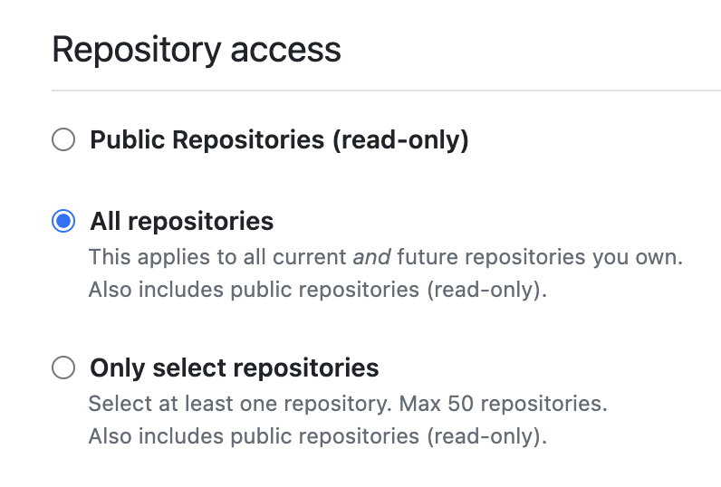
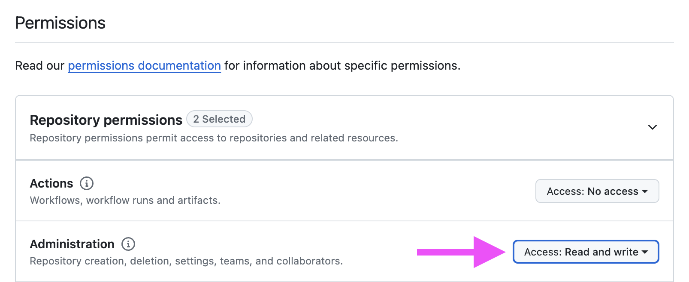

# Deploying to Production

You can deploy SellRepo with Kamal, Heroku, Render, Fly, Hatchbox.io, or your preferred method.

## Payments in production

Only enable one payment processor at a time.

### Stripe

First, you'll need your Stripe production [secret key](https://dashboard.stripe.com/apikeys).

Second, you'll need to set up production webhooks to `https://YOURDOMAIN.com/pay/webhooks/stripe`. Choose the following webhook events:

* charge.succeeded
* charge.refunded
* payment_intent.succeeded
* invoice.upcoming
* customer.subscription.created
* customer.subscription.updated
* customer.subscription.deleted
* customer.subscription.trial_will_end
* customer.updated
* customer.deleted
* checkout.session.completed
* checkout.session.async_payment_succeeded

The webhook signing secret is used to ensure webhooks received came securely from Stripe.

Add to your Environment Variables:

```bash
STRIPE_PRIVATE_KEY=sk_test_1234
STRIPE_SIGNING_SECRET=whsec_1234
```

or to Rails credentials:

```yaml
stripe:
  private_key: sk_test_1234
  signing_secret: whsec_1234
```

### LemonSqueezy

Add your LemonSqueezy [API key](https://app.lemonsqueezy.com/settings/api) as `LEMON_SQUEEZY_API_KEY` environment variable on in the Rails credentials.

Then create a Webhook that points to `https://YOURDOMAIN.com/pay/webhooks/lemon_squeezy`, set a signing secret and enable all the webhooks.

Add to your Environment Variables:

```bash
LEMON_SQUEEZY_STORE_ID=1234
LEMON_SQUEEZY_API_KEY=sk_test_1234
LEMON_SQUEEZY_SIGNING_SECRET=whsec_1234
```

Or to Rails credentials:

```yaml
lemon_squeezy:
  store_id: 1234
  api_key: sk_test_1234
  signing_secret: secret
```

## GitHub Token

Create a GitHub token with the following settings:

1. Expiration

We recommend 90 days or 1 year expiration. You will need to update this key periodically.

2. Repositories

Select the repositories you plan to sell or All repositories.



3. Permissions

Under "Administration" set "Read & Write" access. This is required to add customers to your GitHub repositories.



### Sending email in production

By default, SellRepo is configured to use SMTP for sending emails. To configure your transactional email service, set the following environment variables with the details from your email provider.

```bash
SMTP_HOST=smtp.example.com
SMTP_DOMAIN=yourdomain.com
SMTP_USERNAME=username
SMTP_PASSWORD=password
```

You can change this in `config/environments/production.rb` to use another email service if you prefer.

## Configuration

SellRepo requires some configuration to run in production. We recommend using environment variables but if you're familiar with Rails, you can use Rails credentials.

### Environment Variables (Recommended)

Set the following environment variables on the app at your hosting provider to configure SellRepo.

```bash
SMTP_HOST=smtp.example.com
SMTP_DOMAIN=yourdomain.com
SMTP_USERNAME=username
SMTP_PASSWORD=password

GITHUB_TOKEN=abcd

STRIPE_PRIVATE_KEY=sk_12345
STRIPE_SIGNING_SECRET=whsec_12345

# Or

LEMON_SQUEEZY_STORE_ID=1234
LEMON_SQUEEZY_API_KEY=sk_12345
LEMON_SQUEEZY_SIGNING_SECRET=whsec_12345
```

### Rails Credentials

If you're familiar with Rails, you can use the Rails credentials as an alternative.

```bash
rails credentials:edit --environment=production
```

Then define the options in YAML:

```yaml
smtp:
  host: smtp.example.com
  domain: yourdomain.com
  username: username
  password: password

github:
  token: abcdefg

stripe:
  private_key: sk_test_1234
  signing_secret: whsec_12345

lemon_squeezy:
  api_key: sk_test_1234
  signing_secret: whsec_12345
```

After saving this file, copy the contents of `config/credentials/production.key` to a safe place.
Then add `RAILS_MASTER_KEY` as an environment variable on your production application using the contents of `config/credentials/production.key`.

## Create an admin user

Once deployed, you'll need to create an admin user in your production database. See your hosting provider's documentation about running one-off commands.

Run `bin/rails sellrepo:admin` to create an admin user and pass in your email:

```ruby
bin/rails sellrepo:admin email@example.org
```

A random password will be generated and printed out. You can change your password after logging in and adding your SMTP credentials.
